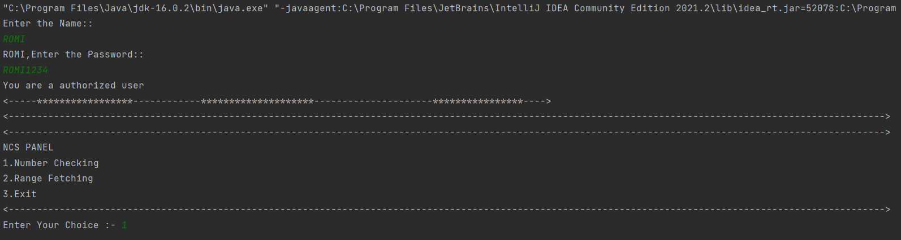
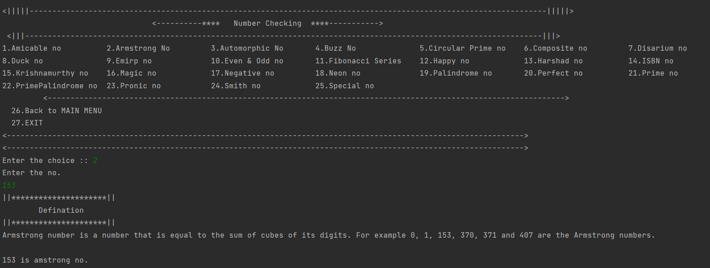
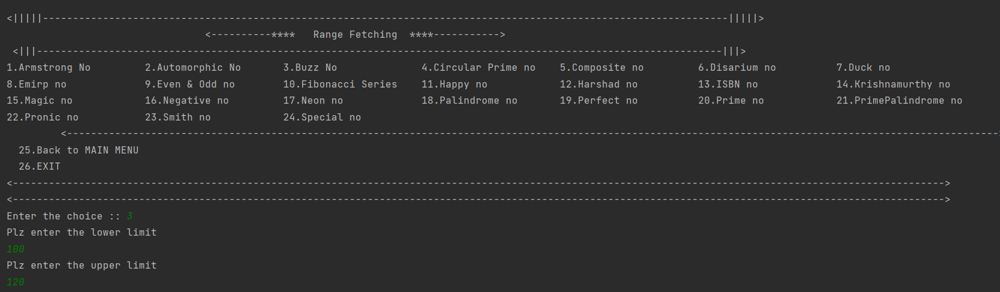
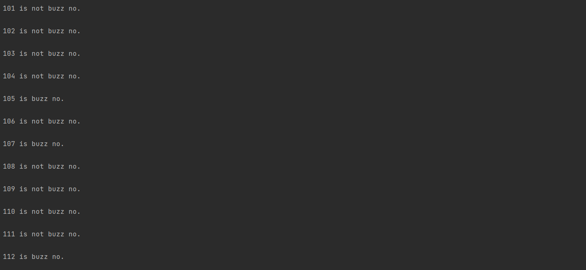
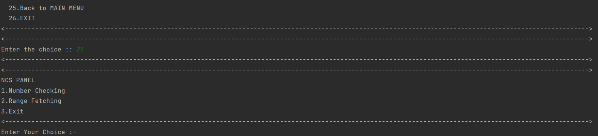
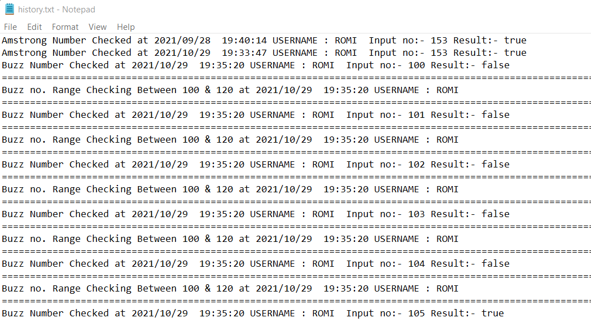

# NCS-JAVA

[](https://shields.io/) 

***This new 'Number Checking System' using Java is created by Biswarup Bhattacharjee, student of BTECH, in University of Engineering and Management, Kolkata.***

**Email Id: bbiswa471@gmail.com.** 

**Contact No: 916290272740.** 


<p align="left">
<a href="https://www.facebook.com/profile.php?id=100070395300810" target="blank"></a>
<a href="https://instagram.com/biswarup2210" target="blank"></a>
<a href="https://github.com/biswa2210" target="blank"></a>
</p>

## About :point_down: 

<div align="justified">
  

</div>

## Purpose :point_down:

<div align="justified">
  
</div>

## Applications :point_down:

<div align="justified">


</div>
 
## Folder Structure :point_down:

```bash

```                       

## Making :point_down:

<div align="justified">


</div>

## Screenshots :point_down: 

<div align="center">
  
<a href="pics/ncs1.png"></a> 

<a href="pics/ncs2.png"></a> 
 
<a href="pics/ncs3.png"></a> 
  
<a href="pics/ncs4.png"></a> 
  
<a href="pics/ncs5.png"></a> 
  
<a href="pics/ncs6.png"></a> 
  
</div>


